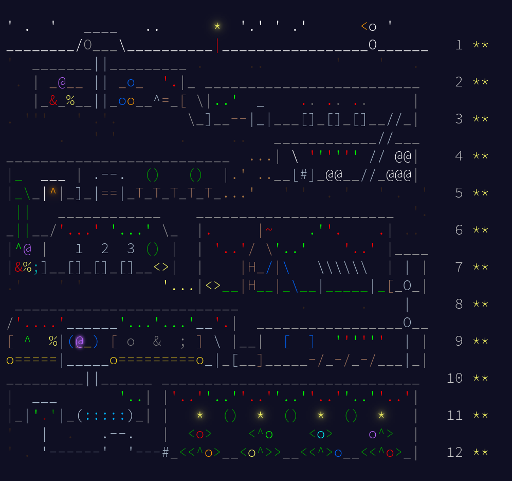

# Advent of Code 2025

This repository contains my solutions for the [Advent of Code 2025](https://adventofcode.com/2025) event.

## Goal
My goal for AoC 2025 is to solve each day's puzzles using a different programming language. \
Note that from selected languages the only one I've used before for actual programming is C and Assembly (not NASM syntax though) and the only language that I actually feel comfortable with is C \
EDIT: Changed Lua to C++ for day 12. EDIT 2: Nice. Found out that solving the example case is harder than the actual case \
so I rewrote the solution from C++ to Lua.\
All other languages I will be using for the first time or my experience with them is limited to seeing some code snippets online. \
The code quality will likely be poor for most languages as I want to finish puzzles the same day they are released and there will be little or no optimization or refactoring. \
It's possible that for some languages I will be using LLMs, but NEVER for coming up with a solution. \
Basically I want to have fun with new languages.

## Plan

### Day 1 - C \[DONE\]

- task1: 0,00s user 0,00s system 45% cpu 0,002 total
- task2: 0,00s user 0,00s system 38% cpu 0,001 total

### Day 2 - Rust \[DONE\]

- task1: 0,05s user 0,00s system 96% cpu 0,058 total
- task2: 0,13s user 0,00s system 96% cpu 0,141 total

### Day 3 - Go \[DONE\]

- task1: 0,00s user 0,00s system 66% cpu 0,002 total
- task2: 0,00s user 0,00s system 84% cpu 0,002 total

### Day 4 - Linux x86-64 NASM Assembly - instead of Zig \[DONE\]

- task1: 0,00s user 0,00s system 76% cpu 0,001 total
- task2: 0,01s user 0,00s system 96% cpu 0,009 total

### Day 5 - D \[DONE\]

- task1: 0,00s user 0,00s system 89% cpu 0,004 total
- task2: 0,00s user 0,00s system 75% cpu 0,005 total

### Day 6 - Kotlin \[DONE\]

- task1: 0,04s user 0,02s system 155% cpu 0,038 total
- task2: 0,07s user 0,01s system 206% cpu 0,039 total

### Day 7 - Haskell \[DONE\]

- task1: 0,02s user 0,00s system 93% cpu 0,024 total
- task2: 0,11s user 0,03s system 93% cpu 0,146 total

### Day 8 - Swift \[DONE\]

- task1: 0,14s user 0,01s system 99% cpu 0,155 total
- task2: 0,24s user 0,01s system 99% cpu 0,258 total

### Day 9 - Elixir \[DONE\]

- task1: 1,33s user 0,13s system 345% cpu 0,421 total
- task2: 3,82s user 0,16s system 135% cpu 2,947 total

### Day 10 - Odin \[DONE\]

- task1: 0,04s user 0,00s system 98% cpu 0,040 total
- task2: 0,01s user 0,00s system 94% cpu 0,019 total

### Day 11 - Ada \[DONE\]

- task1: 0,01s user 0,00s system 91% cpu 0,015 total
- task2: 0,01s user 0,00s system 95% cpu 0,010 total

### Day 12 - Lua \[DONE\]

- task1: 0,00s user 0,00s system 95% cpu 0,005 total

## Thoughts
### C
I love C.

### Rust
Better than expected. Felt very intuitive for simple tasks.

### Zig
Unusable. Even reading a file feels like black magic.

### Go
Exquisite. For the first time using it, it was very intuitive and productive.

### Linux x86-64 NASM Assembly
After a workday and writing this I am too tired to think. Still easier to read from file than with Zig.

### D
Better C++?

### Kotlin
I hate use of var and val keywords and the fact that you can't do reverse for loops with eg. for (i in 100..0).

### Haskell
It's interesting. Unfortunately I was drinking when programming, which in most languages is not a problem, but in this case happened to be one. I came up with a good solution for task 2, made a programming error and went down a spiral of overthinking the puzzle. Long story short, Haskell feels ok, but not for a one day challange. Couldn't do it without slight help from Gemini.

### Swift
Suprisingly syntax is somewhat similar to Kotlin. Didn't like the @main struct way of defining entry point and the fact that math library is not included by default or even importable from standard library. Unfortunately, although I came up with a general solution for task 2, I would not be able to implement it today in a way that it would work in a reasonable time, so I gave Gemini my unoptimized mess of a merging function and it suggested the correct approach with DSU.

### Elixir
Immutability is still weird for me. I don't like the weird pipe syntax and defmodule thing. I wasted around 2h trying to figure out DFS from scratch, because I didn't see that points are in order. Raycasting for the win.

### Odin
Usable Zig. Some syntax choices are interesting, but overall was very intuitive and feature complete. Thank god binding C libraries is trivially easy so using GLPK for the Simplex was possible.

### Ada
Syntax is abysmal. Why does capitalization not matter? WHY?

### Lua
Felt good, but I needed more low level aproach and language I am familiar with to do day 12. EDIT: AoC creator is a funny guy.

## License
This repository is licensed under the [MIT License](LICENSE.md).
